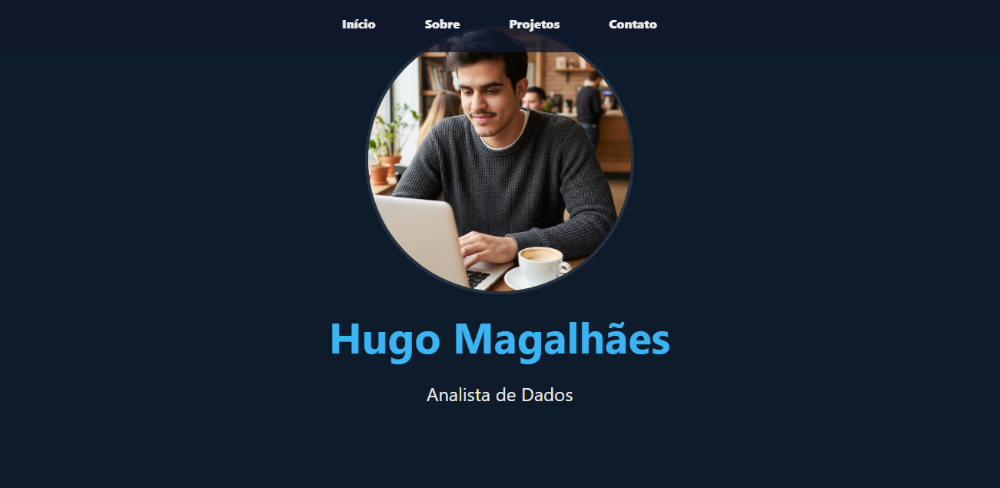

# 🌐 Portfólio Pessoal – Hugo Magalhães

Este é o meu portfólio pessoal desenvolvido para apresentar meus projetos, habilidades e experiências na área de **Análise de dados e Desenvolvimento**.  
O site está online e pode ser acessado aqui: **[🔗 Acesse o Portfólio](https://portfolio-pink-five-36.vercel.app)**  

---

## 📸 Prévia

---

## 💡 Motivação
Este projeto foi criado para publicar meus trabalhos e servir como um **cartão de visitas online**, permitindo que interessados conheçam melhor minhas competências.

---

## ⚙️ Funcionalidades
- Página inicial com introdução  
- Seção de projetos  
- Página de contato com formulário funcional 
- Layout **responsivo**  

---

## 🛠️ Tecnologias Utilizadas
- **Frontend:** HTML, CSS e JavaScript  
- **Deploy:** Vercel  
- **Versionamento:** Git/GitHub  

---

## 📌 Melhorias Futuras
- Adicionar previews dos meus projetos em blocos interativos e funcionais
- Adicionar outras formas de contato

---

## 📬 Contato
- 📧 Email: hugomagalhaesbds@gmail.com

- 💼 LinkedIn: **[Meu Linkedin](https://linkedin.com/in/hugosmagalhaes)**

- 🌐 Portfólio: https://portfolio-pink-five-36.vercel.app
